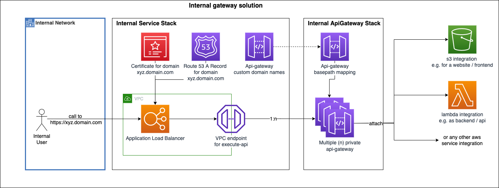

# CDK Internal Gateway

Use this CDK construct to create **internal serverless applications**.

Useful for larger companies to create internal  serverless applications that are not exposed to the internet and only accessible from the internal network.

## Installation

Using Typescript for aws cdk

```bash
npm i cdk-internal-gateway
```

Using Python for aws cdk

```bash
pip install pharindoko.cdk-internal-gateway
```

## Architecture



### Technical Details

- creates an internal application loadbalancer
  - forwards traffic to VPC endpoint for execute-api
  - redirect http to https
- provides a securely configured apigateway resource out of the box
  - attach your aws components to the internal apigateway resource
  - sets api gateway to PRIVATE mode
  - sets resource policies to only allow traffic from vpc endpoint
- generates and attaches custom domains to the API Gateway
- generates and attaches certificates to the the API Gateway and the loadbalancer
- modularized approach with separate constructs
  - add multiple internal api gateways to the same internal service to save costs and keep flexibility

## Requirements

- CDK V2 (2.46.0)
- A VPC
- A VPC Endpoint for execute-api
- A Hosted Zone
- Internally accessible subnets (for the load balancer)

## Usage

> Let`s assume we create a simple internal api for our company and start with a single lambda function...

1. Create a file called `/lib/my-new-stack.ts`

    ```typescript
    import { aws_apigateway as apigateway, aws_ec2 as ec2, aws_lambda as lambda, aws_route53 as route53, Stack, StackProps } from 'aws-cdk-lib';
    import { HttpMethod } from 'aws-cdk-lib/aws-events';
    import { InternalApiGateway, InternalApiGatewayProps, InternalService } from 'cdk-internal-gateway';
    import { Construct } from 'constructs';
    import * as path from 'path';

    // Create a new stack that inherits from the InternalApiGateway Construct
    export class ServerlessStack extends InternalApiGateway {
        constructor(scope: Construct, id: string, props: InternalApiGatewayProps) {
            super(scope, id, props);

            // The internal api gateway is available as member variable
            // Attach your lambda function to the this.apiGateway
            const defaultLambdaJavascript = this.apiGateway.root.resourceForPath("hey-js");
            const defaultHandlerJavascript = new lambda.Function(
                this,
                `backendLambdaJavascript`,
                {
                    functionName: `js-lambda`,
                    runtime: lambda.Runtime.NODEJS_14_X,
                    handler: "index.handler",
                    code: lambda.Code.fromAsset(path.join(__dirname, "../src")),
                }
            );

            defaultLambdaJavascript.addMethod(
                HttpMethod.GET,
                new apigateway.LambdaIntegration(defaultHandlerJavascript)
            );
        }
    }

    // Create a new stack that contains the whole service with all nested stacks
    export class ServiceStack extends Stack {
        constructor(scope: Construct, id: string, props: StackProps) {
            super(scope, id, props);

            // get all parameters to create the internal service stack
            const vpc = ec2.Vpc.fromLookup(this, 'vpcLookup', { vpcId: 'vpc-1234567890' });
            const subnetSelection = {
                subnets: ['subnet-0b1e1c6c7d8e9f0a2', 'subnet-0b1e1c6c7d8e9f0a3'].map((ip, index) =>
                    ec2.Subnet.fromSubnetId(this, `Subnet${index}`, ip),
                ),
            };
            const hostedZone = route53.HostedZone.fromLookup(this, 'hostedzone', {
                domainName: 'test.aws1234.com',
                privateZone: true,
                vpcId: vpc.vpcId,
            });
            const vpcEndpoint =
                ec2.InterfaceVpcEndpoint.fromInterfaceVpcEndpointAttributes(
                    this,
                    'vpcEndpoint',
                    {
                        port: 443,
                        vpcEndpointId: 'vpce-1234567890',
                    },
                );

            // create the internal service stack
            const serviceStack = new InternalService(this, 'InternalServiceStack', {
                hostedZone: hostedZone,
                subnetSelection: subnetSelection,
                vpcEndpointIPAddresses: ['192.168.2.1', '192.168.2.2'],
                vpc: vpc,
                subjectAlternativeNames: ['internal.example.com'],
                subDomain: "internal-service"
            })

            // create your stack that inherits from the InternalApiGateway
            new ServerlessStack(this, 'MyProjectStack', {
                domains: serviceStack.domains,
                stage: "dev",
                vpcEndpoint: vpcEndpoint,
            })

            // create another stack that inherits from the InternalApiGateway
            ... 
            ...
        }
    }
    ```

1. Reference the newly created `ServiceStack` in the default `/bin/{project}.ts` file e.g. like this

    ```typescript
    new ServiceStack(app, 'MyProjectStack', {
    env:
    {
        account: process.env.CDK_DEPLOY_ACCOUNT || process.env.CDK_DEFAULT_ACCOUNT,
        region: process.env.CDK_DEPLOY_REGION || process.env.CDK_DEFAULT_REGION
    }
    ```

## Costs

You have to expect basic infra costs for 2 components in this setup:  

| Count |  Type |  Estimated Costs |
|---|---|---|
|1 x| application load balancer  | 20 $  |
|2 x| network interfaces for the vpc endpoint  | 16 $  |

A shared vpc can lower the costs as vpc endpoint and their network interfaces can be used together...  
